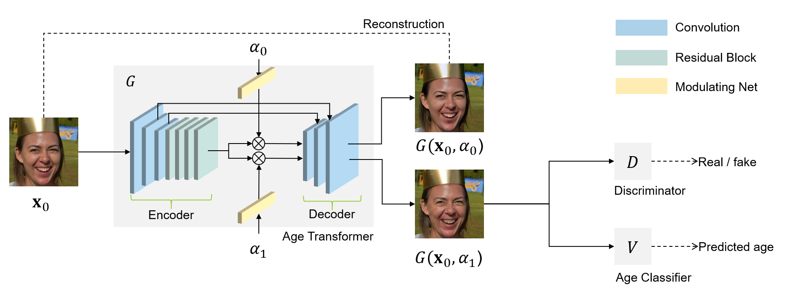

# HRFAE: High Resolution Face Age Editing

You can access the code from our [GitHub Repository](https://github.com/jjjjjjjoanna/DL_Final)

Official implementation for paper [High Resolution Face Age Editing](https://arxiv.org/pdf/2005.04410.pdf).

## Variations

This project implements several variations of HRFAE, including:

1. [dispatchGAN+VGG13+AdaIN](https://github.com/jjjjjjjoanna/DL_Final/tree/dispatchGAN%2BVGG13%2BAdaIN)
2. [dispatchGAN+resnet50](https://github.com/jjjjjjjoanna/DL_Final/tree/dispatchGAN%2Bresnet50)
3. [dispatchGAN+VGG16bn](https://github.com/jjjjjjjoanna/DL_Final/tree/dispatchGAN%2BVGG16bn)
4. [dispatchGAN+VGG16+BMILoss](https://github.com/jjjjjjjoanna/DL_Final/tree/dispatchGAN%2BVGG16%2BMILoss)
5. [dispatchGAN+VGG16](https://github.com/jjjjjjjoanna/DL_Final/tree/dispatchGAN%2BVGG16)

For detailed information about each branch, please refer to its corresponding branch `README.md`.

## Train and Test

For each variation/branch, we provide a notebook `dl_final.ipynb` where environments are set up, so you could easily try out our models.

You could also upload test images in the folder `/test/input` and run all cells then it will test after training. The output images will be saved in the folder `/test/output`. You can change the desired target age with `--target_age`.

## License

Copyright © 2020, InterDigital R&D France. All rights reserved.

This source code is made available under the license found in the LICENSE.txt in the root directory of this source tree.

